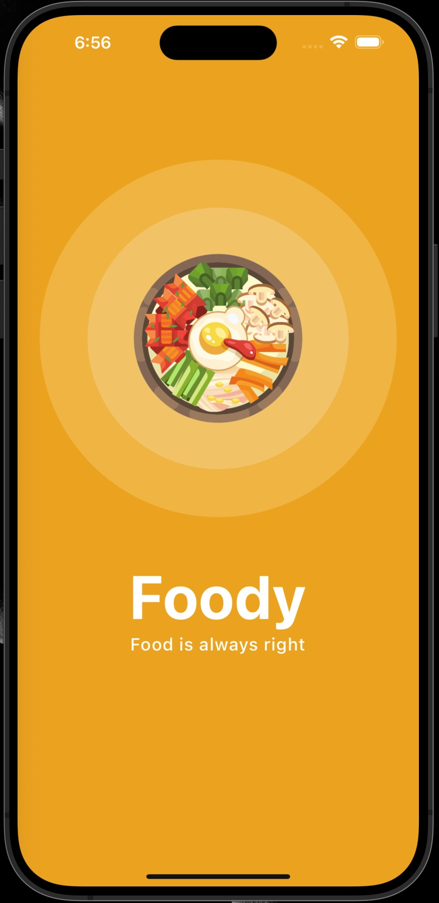
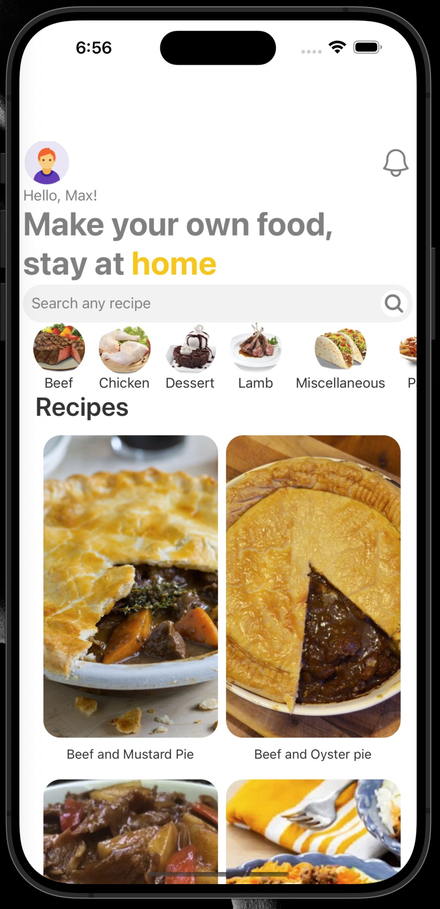
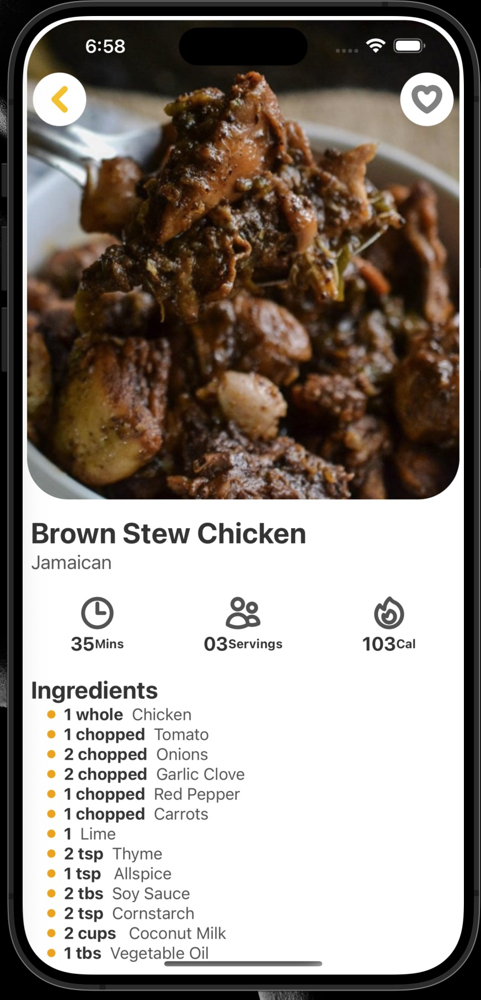
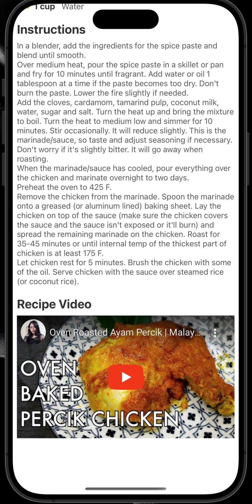

# recipeApp
# Foody - Your Recipe Companion

Foody is a mobile app that helps you discover and organize your favorite recipes. With Foody, you can browse a wide variety of recipes, manage your grocery list, and even watch instructional cooking videos right from your phone or tablet.

## Features

- **Explore Recipes**: Browse through a vast collection of recipes for every meal and occasion.
- **Search and Filter**: Easily find recipes based on ingredients, cuisine, or dietary preferences.
- **Save Favorites**: Save your favorite recipes for quick access later.
- **Create Shopping Lists**: Generate shopping lists based on the recipes you want to cook.
- **Watch Cooking Videos**: Learn new cooking techniques from instructional videos.
- **Offline Access**: Access your saved recipes and shopping lists even when you're offline.

## Screenshots

## Technologies Used

- React Native
- Expo
- Axios
- React Navigation
- React Native Responsive Screen

## Installation

1. Clone the repository.
2. Install dependencies using `npm install`.
3. Start the development server with `npm start`.

## Contributing

Contributions are welcome! If you have any ideas for new features or improvements, feel free to submit a pull request.

## License

This project is licensed under the MIT License - see the [LICENSE.md](LICENSE.md) file for details.
